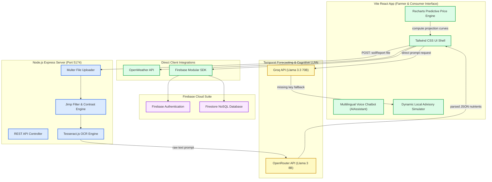
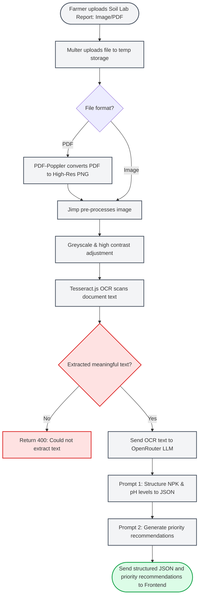

# 🌾 किsan Shakti (Kisan Shakti) — Smart Crop Advisory & IoT Telemetry System

A state-of-the-art, dual-role AI ecosystem engineered for the **Smart India Hackathon (SIH)**. Kisan Shakti empowers Indian farmers with real-time, context-aware AI advisory services, automated soil report OCR scanning, and simulated LoRaWAN IoT telemetry, while offering direct e-commerce channels linking agricultural producers to retail consumers.

🌐 **Live Link**: [https://kisanshakti.com](https://kisanshakti.com) (Simulated Production Host)  
🚀 **SIH Project Portal**: Kisan Shakti Hackathon Repository

---

## 🗺️ System Architecture

The following diagram illustrates the complete modular system architecture of Kisan Shakti, detailing data flows between client UI shells, direct telemetry integrations, secure node servers, and cognitive LLM providers.



---

## 🌪️ Data Processing Flowchart

This flowchart outlines the automated backend OCR scanning pipeline. Uploaded document files are converted, normalized, extracted, and structured into prioritized recommendations.



---

## 🛡️ Modular Feature Deep Dive

### 📡 1. Live IoT Telemetry & Farm Automation (Farmer Panel)
*   **Sensor Telemetry Console**: Integrates simulated real-time telemetry updates showing **Soil Moisture**, **Ambient Soil Temperature**, and **NPK Chemical parts per million (ppm)**.
*   **Command Control**: Dynamic water pump toggle command with a simulated LoraWAN network propagation delay (`1.5s`). If activated, it offers optimized warnings regarding auto shutting based on AI-estimated soil humidity indexes.

### 📈 2. AI Mandi Price Trend Predictor (MSP Center)
*   **Forecast Modeling**: Displays an interactive price trend chart powered by `recharts` plotting 6-month projected values based on the crop variety selected and the state mandi market.
*   **Tactical Insights**: Computes localized hold-or-sell decisions (e.g. recommending inventory holding to exploit expected autumn supply chain contractions).

### 📄 3. Intelligent Soil Report OCR Scanner (Soil Page)
*   **File Drag-and-Drop Area**: Accept lab test reports as PNG, JPG, or multi-page PDFs.
*   **Structured Auto-Fill**: Parses the OCR document scan data, automatically capitalizing NPK ratings (`Low`, `Medium`, `High`), and populating numbers for pH levels and organic matter directly into the advisory form fields.

### 🎙️ 4. Floating Multilingual AI Advisor (Chatbot Component)
*   **Full Context Integration**: Directly accesses client-side session variables (weather metrics, primary crop type, soil profile, GPS coordinates) and wraps them inside the system prompts dynamically.
*   **Accessibility Offline Fallback**: If a Groq API key is missing, all chatbot questions gracefully fall back to an offline simulated agricultural advisory module, preventing network crashes and providing answers instantly.

---

## 🛠️ Configuration & Installation Roadmap

Follow this step-by-step roadmap to clone, configure, and boot Kisan Shakti locally:

### 1. Repository Setup
```bash
# Clone the repository
git clone https://github.com/Abhishek-Ag-1112/Kisan-Shakti.git

# Navigate into the project folder
cd Kisan-Shakti
```

### 2. Environment Variables Configuration
To run all modules successfully, you must configure two environment files at the root of the project:

#### Client Configuration: `.env.local`
Create `.env.local` and add the following parameters (replacing placeholders with your active credentials):
```env
VITE_FIREBASE_API_KEY='your_firebase_key'
VITE_FIREBASE_AUTH_DOMAIN='smart-farm-xxxxx.firebaseapp.com'
VITE_FIREBASE_PROJECT_ID='smart-farm-xxxxx'
VITE_FIREBASE_STORAGE_BUCKET='smart-farm-xxxxx.appspot.com'
VITE_FIREBASE_MESSAGING_SENDER_ID='your_sender_id'
VITE_FIREBASE_APP_ID='your_app_id'
VITE_OPENWEATHER_API_KEY='your_openweathermap_api_key'
VITE_GROQ_API_KEY='your_groq_api_key' # Leave empty to use local chatbot simulation fallback
```

#### Server Configuration: `.env`
Create `.env` and configure the OpenRouter LLM API key:
```env
OPENROUTER_API_KEY="your_openrouter_api_key"
```

### 3. Start Development Services
Run the following package scripts to boot both front-end and back-end concurrently:
```bash
# Install NPM dependencies
npm install

# Start both Vite client (localhost:5173) and Node server (localhost:5174)
npm start
```

---

## 🤝 Contribution & Collaboration Guidelines

We welcome developer contributions to make Kisan Shakti more robust! Follow these instructions to submit features or bug fixes:

### 1. Branch Naming Standard
Ensure your branch name matches the contribution pattern:
*   Features: `feat/short-description` (e.g. `feat/crop-yield-calculator`)
*   Fixes: `fix/bug-reference` (e.g. `fix/ocr-timeout`)
*   Documentation: `docs/readme-flow`

### 2. Development Workflow
1.  **Fork the Repository** and clone your fork locally.
2.  **Create your Branch**:
    ```bash
    git checkout -b feat/my-new-feature
    ```
3.  **Validate Linting & Compilation**:
    ```bash
    npm run lint
    npm run build
    ```
4.  **Commit Your Changes** using semantic commit messaging:
    ```bash
    git commit -m "feat: integrate crop yield estimation calculator inside sell page"
    ```
5.  **Push to GitHub** and open a Pull Request (PR) to the parent repository's `main` branch.

---

## 🔮 Future Roadmap

*   **Regional Language voice models**: Integrate local TTS models supporting Hindi, Gujarati, Punjabi, Telugu, and Tamil voice outputs directly.
*   **Satellite Leaf Area Index (LAI)**: Enable active map overlays showing historical vegetation stress vectors.
*   **Krishi Kendra Locator (KVK Map)**: Add a real-time Leaflet/OpenStreetMap widget mapping local government support centers.
